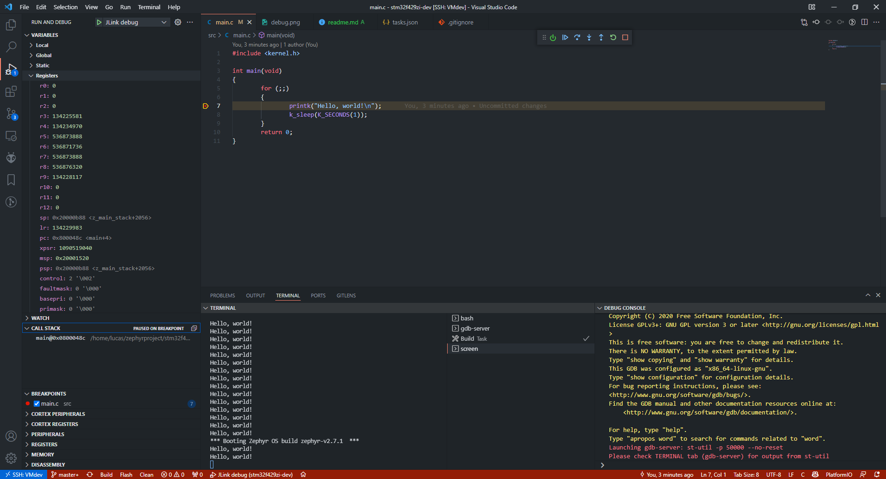

# Reference project for developping on `nucleo_stm32f429zi`

- See : https://github.com/lucasdietrich/AVRTOS/commit/d0cf617db99931dfa41274301123bbdaff74aed1

## Prerequisites

- `nucleo_stm32f429zi`
- `Zephyr RTOS` with `west`
- `VS Code`

## Development

Generated files :
- [./build/zephyr/zephyr.dts](./build/zephyr/zephyr.dts)
- [./build/zephyr/include/generated/autoconf.h](./build/zephyr/include/generated/autoconf.h)

## Commands

- Build with `west build`
- Flash with `west flash --serial {$serialNumber}`
- Monitor with `screen /dev/ttyACM0 115200`
- Debug with F5

